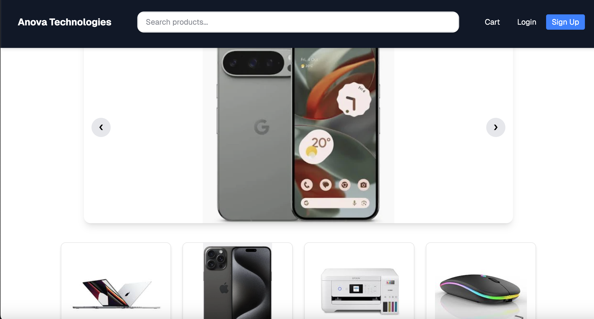
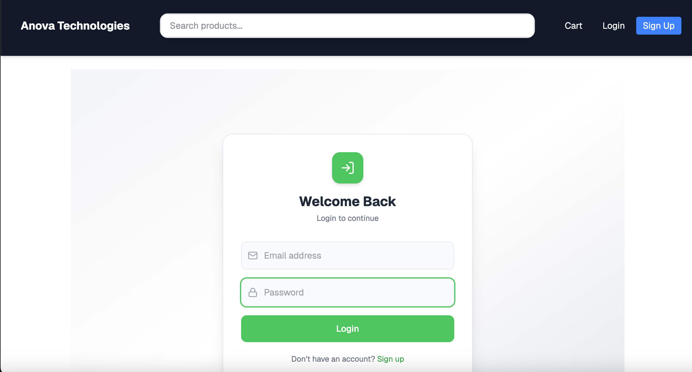
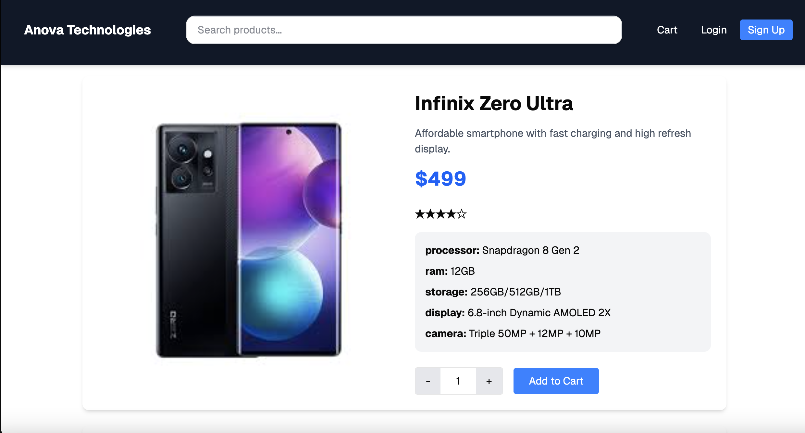

# Anova Technologies E-Commerce App
By: Anova Technologies 20/05/2025 

A modern full-stack e-commerce web application built with React, Firebase, json and Tailwind CSS.
It provides a seamless shopping experience with authentication, product browsing, cart management, and checkout flow.
## Features
- User Authentication (Login/Sign Up with Firebase)
- Dynamic Product Pages
- Add to Cart/Remove from Cart functionality
- Quantity Management in Cart
- Checkout flow
- Firestore database integration
- Modern responsive UI with Tailwind CSS
- Fast and Optimized React components
## Tech Stack
- React
- Styling: Tailwind CSS
- Backend 
    - Firebase
        - User Authentication
        - Firestore Database
    - Json
         - Product Management

## UI Preview
### Homepage

### Sign Up

### Login

### Product Details

## Installation & Setup

### Clone the Repository
- git clone https://github.com/dkdukes/Anova_Computer
- cd Anova_Computer
### Installing dependencies
- npm install
### Run the project
- npm run dev
## Core Features
### Authentication
Users can sign up and log in securely using Firebase Authentication.
### Product System
Products are dynamically loaded and displayed from a database.
### Cart System
- Add products to cart
- Update quantity
- Remove items instantly
- Live total calculation
### Checkout
An order is placed and the cart is reset
## Future Improvements
- Admin dashboard for product management
- Payment gateway integration (Mpesa/Visa)
- Order history tracking
- Product search & filters
- Wishlist feature
- Dark mode UI
## License
This project is open-source and available under the MIT License

